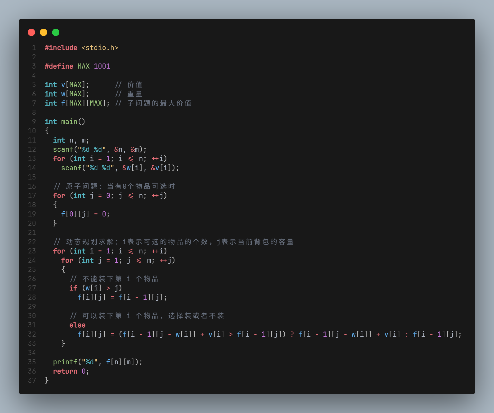
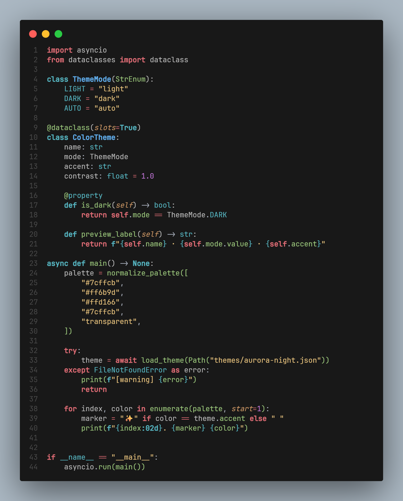
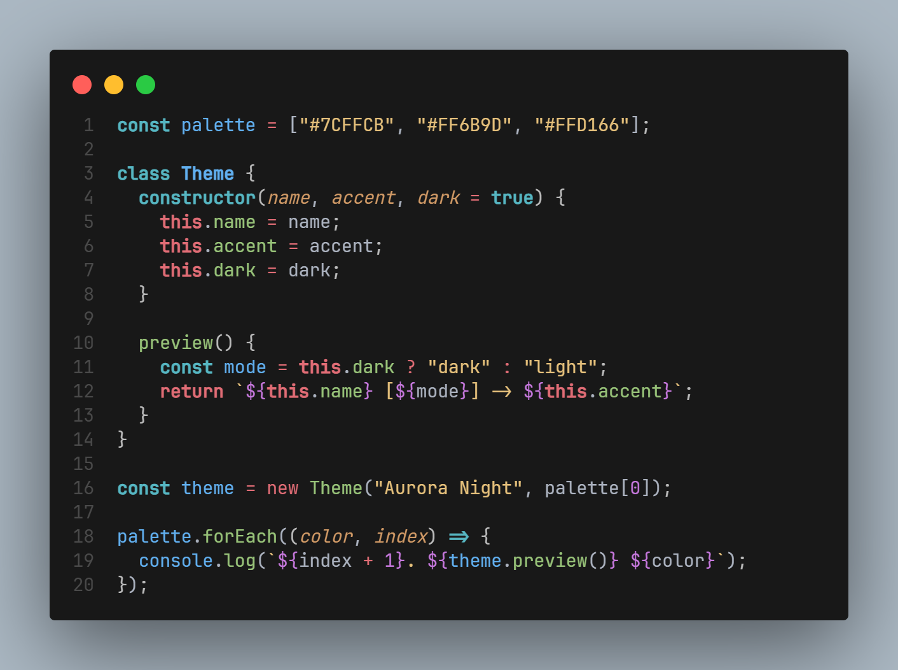
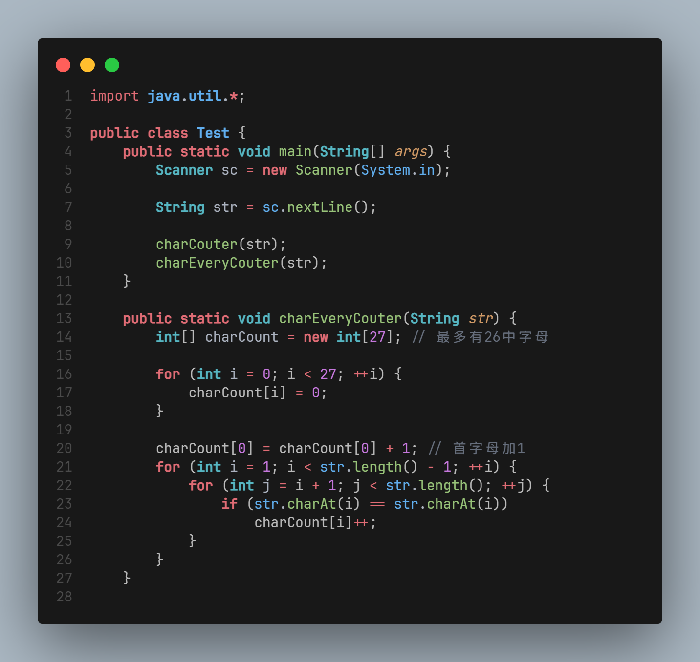

# 🎨 One Monokai Pro

A beautiful dark theme for Visual Studio Code inspired by [One Monokai](https://github.com/azemoh/vscode-one-monokai) color scheme, enhanced with bold keywords and a refined color palette for superior code readability.

## 📸 Screenshots
- C/C++


- Python


- JS


- Java


## ✨ Features

- **🎯 Enhanced Bold Keywords**: Important keywords like `if`, `for`, `class`, `function` are bold for better code structure visibility
- **🌙 Dark & Comfortable**: Easy on the eyes during long coding sessions
- **🎨 Refined Color Palette**: Carefully selected colors that provide excellent contrast and readability
- **📝 Comprehensive Language Support**: Optimized for JavaScript, TypeScript, Python, HTML, CSS, and more
- **🔧 Consistent UI**: Harmonious interface colors that complement the syntax highlighting

## 🚀 Installation

### Via VS Code Marketplace
1. Open **Extensions** sidebar panel in VS Code (`Ctrl+Shift+X`)
2. Search for `One Monokai Pro`
3. Click **Install**
4. Go to **File > Preferences > Color Theme** and select **One Monokai Pro**

### Via Command Line
```bash
code --install-extension zzhua095.one-monokai-pro
```

## 🎨 Color Palette

| Element | Color | Usage |
|---------|-------|-------|
| **Background** | `#181818` | Editor background |
| **Foreground** | `#abb2bf` | Default text |
| **Keywords** | `#e06c75` | Control flow, storage keywords (bold) |
| **Strings** | `#e5c07b` | String literals |
| **Functions** | `#98c379` | Function names (bold) |
| **Classes** | `#61afef` | Class names (bold) |
| **Types** | `#56b6c2` | Type keywords (bold) |
| **Constants** | `#56b6c2` | Built-in constants (bold) |
| **Numbers** | `#c678dd` | Numeric values |
| **Comments** | `#676f7d` | Code comments |

## 🔥 What's Special

### Bold Keywords for Better Structure
- **Control Flow**: `if`, `else`, `for`, `while`, `return`, `break`, `continue`
- **Declarations**: `var`, `let`, `const`, `function`, `class`
- **Built-in Constants**: `true`, `false`, `null`, `undefined`, `this`
- **Import/Export**: `import`, `export`, `from`
- **HTML Tags**: All HTML/XML tag names

### Optimized for Modern Development
- Perfect for React, Vue, Angular development
- Excellent TypeScript support
- Works well with Python, Go, Rust, and other languages
- Markdown support with proper emphasis


## 🛠️ Customization

You can customize this theme by adding the following to your `settings.json`:

```json
{
  "editor.tokenColorCustomizations": {
    "[One Monokai Pro]": {
      "comments": "#your-color-here"
    }
  }
}
```

## 🤝 Contributing

Found a bug or have a suggestion? Please open an issue on [GitHub](https://github.com/Huazzi/vscode-one-monokai-pro/issues).

## 📄 License

This theme is licensed under the [MIT License](LICENSE).

## 🙏 Acknowledgments

- Inspired by One Monokai theme
- Color palette influenced by One Dark Pro and Atom One Dark
- Thanks to the VS Code community for feedback and suggestions

---

**Enjoy coding with One Monokai Pro!** 🚀

If you like this theme, please consider:
- ⭐ Starring the [GitHub repository](https://github.com/Huazzi/vscode-one-monokai-pro)
- 📝 Leaving a review on the [VS Code Marketplace](https://marketplace.visualstudio.com/items?itemName=zzhua095.one-monokai-pro)
- 🐦 Sharing it with your developer friends
